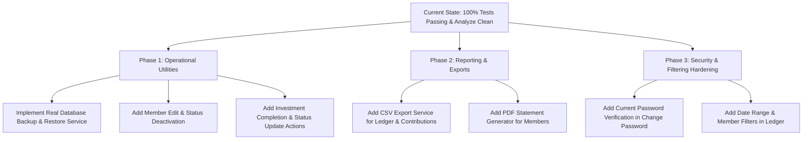

# Comprehensive Code Review & Missing Functionality Audit
**Project:** Group Investment & Contribution Management System  
**Audit Date:** August 2026  
**Architecture:** Clean Architecture · Flutter · Riverpod · SQLite FFI · GoRouter  
**Target Platforms:** Windows Desktop (Primary), Web, Mobile  

---

## 1. Executive Summary & Code Health

A clean, fresh audit of the entire codebase was conducted across all 51+ Dart files, database schema, security mechanisms, state management providers, router configuration, and test suites.

### Current System Health:
- **Static Analysis (`flutter analyze`):** **0 issues found** (100% clean).
- **Test Suite (`flutter test`):** **41 / 41 passing tests** (100% pass rate).
- **State Management:** Fully standardized on **Flutter Riverpod** (zero `setState` in feature screens, centralized reactive notifiers).
- **Security:** PBKDF2 HMAC-SHA256 password hashing (100,000 iterations, constant-time comparison), hardware MachineGuid lock with disk JSON persistence, and strict RBAC (`SUPER_ADMIN`, `ADMIN`, `MEMBER`).
- **Data Integrity:** SQLite atomic transactions for multi-table writes (`createMemberWithUser`, `recordContribution`, `reviewWithdrawalRequest`, `distributeProfitProRata`, `recordInvestmentLoss`).

---

## 2. Module-by-Module Code Review

| Module / Feature | Current Implementation Status | Code Quality & Architecture Rating | Key Observations |
|---|:---:|:---:|---|
| **Authentication & Setup** | Complete | **9.5 / 10** | Universal login via Email, Mobile Number, or Username. Auto-assigned usernames. PBKDF2 KDF. Legacy hash auto-upgrade. |
| **Hardware Device Lock** | Complete | **9.0 / 10** | Persistent JSON config at `C:\ProgramData\GroupInvestmentManagement\config\device_lock.json`. Wildcard `*` and MachineGuid matching. |
| **Dashboard** | Complete | **9.0 / 10** | Role-segmented UI (Admin vs Member views). Responsive grids (`LayoutBuilder`). Monthly bar charts and allocation pie charts. |
| **Member Directory** | Complete | **8.5 / 10** | Aggregated SQL `GROUP BY` query. Privacy masking for member views. Atomic creation with user credentials. |
| **Contributions** | Complete | **8.5 / 10** | Admin payment collection with automatic double-entry ledger recording and notification triggers. |
| **Contribution Requests** | Complete | **8.5 / 10** | Member-initiated add-money workflow. Admin approval/rejection queue with atomic transaction state changes. |
| **Investments** | Complete | **8.0 / 10** | Tracks deployment portfolio, expected vs actual returns, and deployment status. |
| **Profit & Loss Distribution** | Complete | **9.0 / 10** | Pro-rata mathematical distribution based on exact contribution percentages. Handles both profit and capital loss allocations. |
| **Withdrawals** | Complete | **9.0 / 10** | Overdraft protection guard inside SQLite transaction. Member request and Admin review pipeline. |
| **Ledger & Audit Trail** | Complete | **8.5 / 10** | Double-entry transaction logging and append-only system audit log recording. |
| **Settings & Admin Console** | Complete | **8.5 / 10** | Super Admin user accounts management, role changes, password resets, and hardware lock configuration. |

---

## 3. Identified Missing Functionality & Improvement Opportunities

### High Priority (Core Business & Operational Capabilities)

#### 1. Functional SQLite Database Backup & Restore Execution
- **Current State:** The "Export Backup" button in Settings triggers a SnackBar message, but does not execute the actual binary copy of `investment_management.db` to the backup directory (`C:\ProgramData\GroupInvestmentManagement\backups`).
- **Missing Feature:**
  - Automated timestamped database file copy (`backup_YYYY-MM-DD_HHmmss.db`).
  - "Restore from Backup" file picker allowing Super Admin to restore from a previous snapshot.
  - Integrity check (`PRAGMA integrity_check`) before and after restoration.

#### 2. Member Profile Editing & Lifecycle Management (Deactivation / Reactivation)
- **Current State:** Members can be added, but their contact details (phone, email) cannot be updated if they change. There is no soft deactivation toggle to mark a member `INACTIVE` when they leave the group.
- **Missing Feature:**
  - "Edit Member" modal dialog (update name, email, phone).
  - "Deactivate Member" action (preventing new contributions while preserving historical ledger balances).

#### 3. Investment Lifecycle Completion & Liquidation Workflow
- **Current State:** Investments are added with `ACTIVE` status. When returns are realized, profit is distributed via the Profit/Loss screen, but the investment record itself cannot be updated to `COMPLETED` or `LIQUIDATED` directly.
- **Missing Feature:**
  - "Mark as Completed / Liquidated" action on investment cards.
  - "Edit Investment Details" (actual return, maturity date, status notes).

---

### Medium Priority (Reporting, Analytics & UX Enhancements)

#### 4. Statement & Report Exporting (PDF / CSV / Excel)
- **Current State:** Financial tables can be viewed on-screen, but cannot be exported for physical meetings, tax audits, or external recordkeeping.
- **Missing Feature:**
  - **Export Member Statement (PDF):** Member's approved contributions, profit allocations, withdrawals, and net balance.
  - **Export Master Ledger (CSV / Excel):** Complete transaction audit trail filtered by date range.
  - **Export Investment Summary (PDF):** Total pool deployment, active holdings, and ROI breakdown.

#### 5. Advanced Ledger Date Range & Member Filtering
- **Current State:** Ledger screen supports type filtering (`CONTRIBUTION`, `INVESTMENT`, `PROFIT`, etc.), but does not filter by custom date ranges or individual members.
- **Missing Feature:**
  - Date Range Picker (`From Date` - `To Date`).
  - Member Dropdown Filter (view all transactions for a specific member).
  - Search by Transaction ID / Reference Number.

#### 6. User Current Password Verification on Password Change
- **Current State:** In `SettingsScreen`, clicking "Change My Password" directly prompts for new password without validating the user''s current password first.
- **Missing Feature:**
  - Add "Current Password" field with hash verification before applying new password.

---

### Low Priority (Desktop Shell & Platform Polishing)

#### 7. Windows Desktop Window Constraints
- **Current State:** Default Flutter desktop window size and behavior.
- **Missing Feature:**
  - Set minimum window dimensions (e.g. 1024x700) using `window_manager` to prevent extreme window compression.
  - Window title bar customization matching `AppColors.surfacePage`.

#### 8. Auto-Refresh / Polling Interval for Notifications
- **Current State:** Notifications reload upon manual screen navigation or action completion.
- **Missing Feature:**
  - Periodic background timer (e.g. every 60 seconds) to refresh unread notification counts for real-time alerts.

---

## 4. Implementation Recommendations & Next Steps

---

*Report compiled and verified against the live codebase.*
